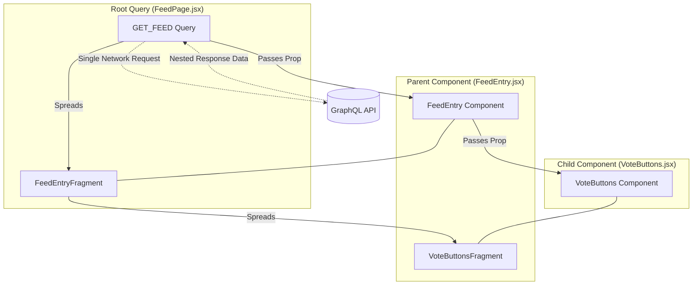

# Design Spec: Standardizing GraphQL Strategy with Apollo Client & Fragment Colocation

**Date:** 2026-04-17  
**Author:** Gemini CLI  
**Status:** Draft 📝  
**Parent Page ID:** `857767958`  
**Target Space:** `~712020d489d6eb8d5d48249957abf71e503285` (Firman Nio)

---

## 1. Objective

Standardize the GraphQL data fetching pattern across the codebase by moving away from external `.gql` files and `@generated/graphql` hooks. Instead, adopt inline `gql` templates from `@apollo/client` and enforce **Fragment Colocation** to ensure components explicitly declare their own data requirements.

---

## 2. Rationale

### Why move away from `.gql` and `@generated/graphql` hooks?
*   **Separation of Concerns vs. Fragmentation:** While separate files seem organized, they often lead to "fragmentation" where the UI logic in a component is physically distanced from the data it depends on.
*   **Boilerplate & Indirection:** Auto-generated hooks add an abstraction layer that can make it harder to trace exactly what fields a component is requesting without jumping through multiple files.
*   **Stale Dependencies:** It's easier for a parent query to over-fetch data that a child no longer needs if the requirements aren't colocated.

### Benefits of Apollo Client Primitives + Colocation
*   **Encapsulation:** Each component defines exactly what it needs via a `fragment`.
*   **Developer Experience (DX):** Adding a field to the UI and the query happens in the same file.
*   **Maintainability:** If a component is deleted, its data requirements (fragment) are deleted with it, preventing query bloat in the parent.
*   **Type Safety:** Fragments can still be used with tools like `graphql-codegen` to generate specific types for props, maintaining type safety without the need for monolithic query hooks.

---

## 3. Implementation Pattern

### A. Fragment Definition (Child Component)
The child component defines its own data requirements.

```javascript
// VoteButtons.jsx
import { gql } from '@apollo/client';

export const VOTE_BUTTONS_FRAGMENT = gql`
  fragment VoteButtonsFragment on FeedEntry {
    score
    vote {
      choice
    }
  }
`;

export function VoteButtons({ entry }) {
  // Component logic using entry.score and entry.vote
}
```

### B. Fragment Composition (Intermediate Component)
The parent component aggregates fragments from its children.

```javascript
// FeedEntry.jsx
import { gql } from '@apollo/client';
import { VOTE_BUTTONS_FRAGMENT, VoteButtons } from './VoteButtons';

export const FEED_ENTRY_FRAGMENT = gql`
  fragment FeedEntryFragment on FeedEntry {
    id
    commentCount
    ...VoteButtonsFragment
  }
  ${VOTE_BUTTONS_FRAGMENT}
`;

export function FeedEntry({ entry }) {
  return (
    <div>
      <span>{entry.commentCount} comments</span>
      <VoteButtons entry={entry} />
    </div>
  );
}
```

### C. Root Query Execution (Page/Container)
The top-level component executes the full query.

```javascript
// FeedPage.jsx
import { gql, useQuery } from '@apollo/client';
import { FEED_ENTRY_FRAGMENT, FeedEntry } from './FeedEntry';

const GET_FEED = gql`
  query GetFeed {
    feed {
      id
      ...FeedEntryFragment
    }
  }
  ${FEED_ENTRY_FRAGMENT}
`;

export function FeedPage() {
  const { loading, error, data } = useQuery(GET_FEED);
  
  if (loading) return <p>Loading...</p>;
  if (error) return <p>Error: {error.message}</p>;

  return (
    <div>
      {data.feed.map(entry => (
        <FeedEntry key={entry.id} entry={entry} />
      ))}
    </div>
  );
}
```

---

## 4. Visual Hierarchy (Roll-up Pattern)

This diagram illustrates how fragments are "rolled up" from the leaf components to the root query.



---

## 5. References

*   [Apollo Client: Queries](https://www.apollographql.com/docs/react/v3/data/queries)
*   [Apollo Client: Colocating Fragments](https://www.apollographql.com/docs/react/v3/data/fragments#colocating-fragments)
