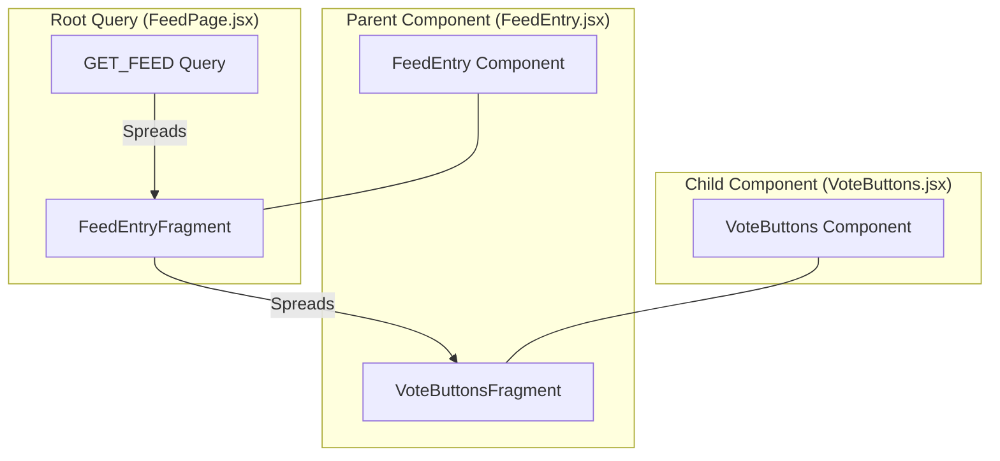

# Standardizing GraphQL Strategy: Apollo Client & Fragment Colocation

## 1. Objective
Standardize the GraphQL data fetching pattern across the codebase by moving away from external `.gql` files and `@generated/graphql` hooks. Instead, adopt inline `gql` templates from `@apollo/client` and enforce **Fragment Colocation**.

## 2. Rationale
### Why move away from `.gql` and `@generated/graphql` hooks?
* **Separation of Concerns vs. Fragmentation:** Physical distance between UI logic and data dependencies.
* **Boilerplate & Indirection:** Generated hooks add an abstraction layer that obscures field tracing.
* **Stale Dependencies:** Risk of over-fetching when children components change but parent queries aren't updated.

### Benefits of Apollo Client Primitives + Colocation
* **Encapsulation:** Components explicitly declare their data needs via fragments.
* **DX:** UI and data requirements updated in one place.
* **Maintainability:** Automatic cleanup of data requirements when components are removed.

## 3. Implementation Examples

### A. Fragment Definition (Child Component)
```javascript
// VoteButtons.jsx
import { gql } from '@apollo/client';

export const VOTE_BUTTONS_FRAGMENT = gql`
  fragment VoteButtonsFragment on FeedEntry {
    score
    vote {
      choice
    }
  }
`;
```

### B. Fragment Composition (Intermediate Component)
```javascript
// FeedEntry.jsx
import { gql } from '@apollo/client';
import { VOTE_BUTTONS_FRAGMENT } from './VoteButtons';

export const FEED_ENTRY_FRAGMENT = gql`
  fragment FeedEntryFragment on FeedEntry {
    id
    commentCount
    ...VoteButtonsFragment
  }
  ${VOTE_BUTTONS_FRAGMENT}
`;
```

### C. Root Query Execution (Page/Container)
```javascript
// FeedPage.jsx
import { gql, useQuery } from '@apollo/client';
import { FEED_ENTRY_FRAGMENT } from './FeedEntry';

const GET_FEED = gql`
  query GetFeed {
    feed {
      id
      ...FeedEntryFragment
    }
  }
  ${FEED_ENTRY_FRAGMENT}
`;
```

## 4. Visual Hierarchy (Roll-up Pattern)


## 5. References
* [Apollo Client: Queries](https://www.apollographql.com/docs/react/v3/data/queries)
* [Apollo Client: Colocating Fragments](https://www.apollographql.com/docs/react/v3/data/fragments#colocating-fragments)
